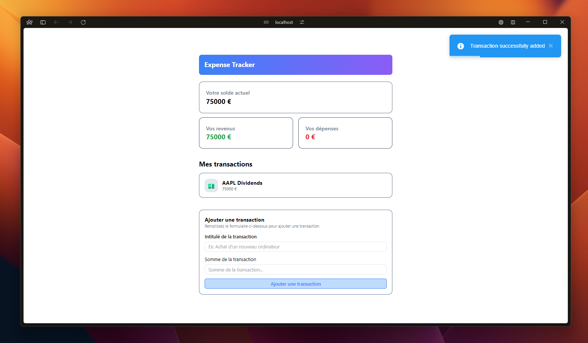

# Budget Tracker

A simple budget tracker app built using Vue.js and Tailwind CSS.

### Development Stack
- Vue.js
- Tailwind CSS

### How to run this project ?
To run this project on your local environment, follow the following steps :
- Clone the repository to your local machine or download the source code.
- Run the command `npm install` in the project directory to install the **required** dependencies
- Run the command `npm run start` to start the `production build` of the project.
- Open your internet browser and go to the following address: [http://localhost:3000](http://localhost:5173)

